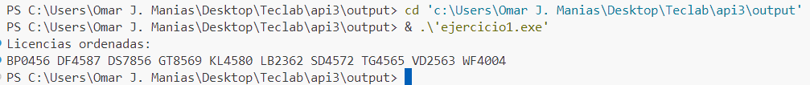
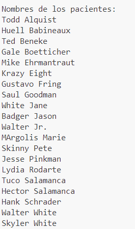

# CONSIGNA:

**Requerimiento 1.**
1. Uno de los módulos que administra las licencias de los pacientes funciona
correctamente, pero al no estar ordenada la información, el tiempo que ocupa el
personal es excesivo. Se te solicita ordenar el siguiente arreglo, que contiene las
licencias del día. Este debe estar ordenado de forma ascendente.
LB2362 - VD2563 - DS7856 - GT8569 - SD4572 - WF4004 - TG4565 - BP0456 - KL4580 - DF4587

**Requerimiento 2.**
1. Se solicita guardar los nombres de los 20 pacientes que se atienden en el centro de
salud, separando la información de la siguiente manera:
• Primer nombre.
• Apellido paterno

2. De acuerdo a la estructura de datos determinada en el punto anterior, aplica
un algoritmo que permita ordenar de menor a mayor. Genera el código para
llevar a cabo el ordenamiento, considerando el apellido paterno como criterio.